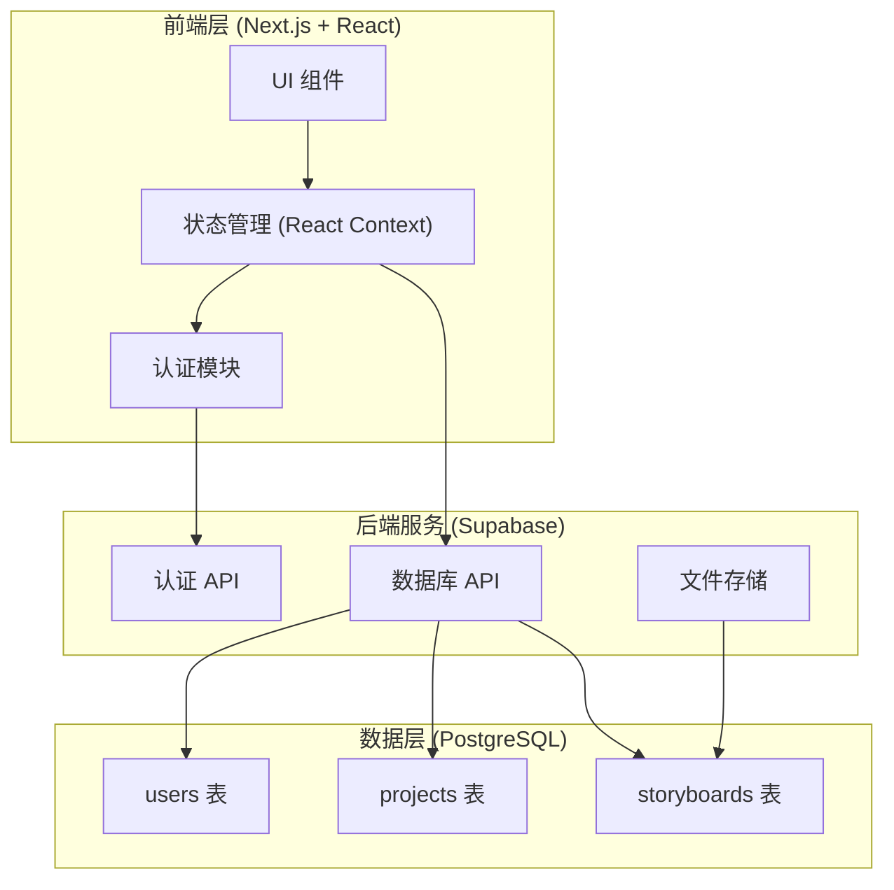
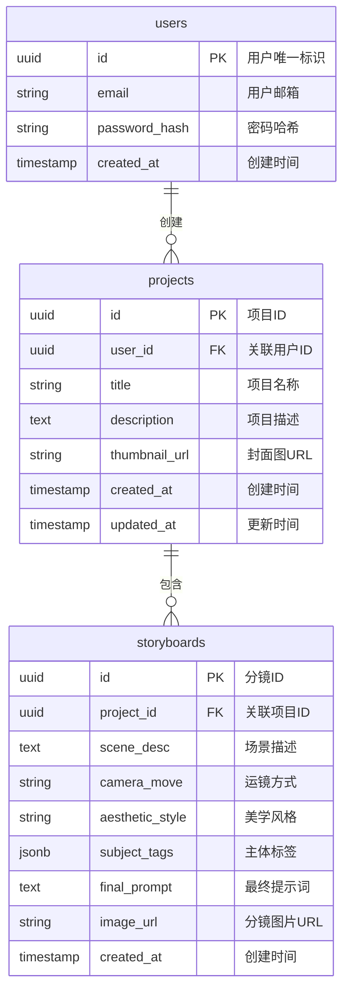

## 1. 架构设计



## 2. 技术说明

- **前端框架**：Next.js 14 (App Router) + React 18
- **样式方案**：Tailwind CSS 3 + CSS Variables
- **UI 组件**：自定义组件 + Radix UI 原语
- **状态管理**：React Context + useReducer
- **认证服务**：Supabase Auth
- **数据库**：Supabase PostgreSQL
- **文件存储**：Supabase Storage
- **初始化工具**：create-next-app

## 3. 路由定义

| 路由 | 用途 | 权限 |
|------|------|------|
| `/` | 重定向到登录页或工作台 | 公开 |
| `/login` | 登录/注册页面 | 公开 |
| `/dashboard` | 工作台大盘 | 需登录 |
| `/project/[id]` | 分镜工作区 | 需登录 |
| `/project/[id]/storyboard/[sid]` | 单个分镜详情 | 需登录 |

## 4. API 定义

### 4.1 认证 API (Supabase Auth)

```typescript
interface AuthUser {
  id: string;
  email: string;
  created_at: string;
}

interface AuthResponse {
  user: AuthUser | null;
  session: Session | null;
  error: Error | null;
}

// 登录
async function signIn(email: string, password: string): Promise<AuthResponse>;

// 注册
async function signUp(email: string, password: string): Promise<AuthResponse>;

// 登出
async function signOut(): Promise<void>;

// 获取当前用户
async function getCurrentUser(): Promise<AuthUser | null>;
```

### 4.2 项目 API

```typescript
interface Project {
  id: string;
  user_id: string;
  title: string;
  description?: string;
  thumbnail_url?: string;
  created_at: string;
  updated_at: string;
}

interface CreateProjectInput {
  title: string;
  description?: string;
  thumbnail_url?: string;
}

// 获取用户所有项目
async function getProjects(): Promise<Project[]>;

// 创建新项目
async function createProject(input: CreateProjectInput): Promise<Project>;

// 获取单个项目
async function getProject(id: string): Promise<Project | null>;

// 更新项目
async function updateProject(id: string, input: Partial<CreateProjectInput>): Promise<Project>;

// 删除项目
async function deleteProject(id: string): Promise<void>;
```

### 4.3 分镜 API

```typescript
interface Storyboard {
  id: string;
  project_id: string;
  scene_desc: string;
  camera_move: string;
  aesthetic_style: string;
  subject_tags: string[];
  final_prompt: string;
  image_url?: string;
  created_at: string;
}

interface CreateStoryboardInput {
  project_id: string;
  scene_desc: string;
  camera_move: string;
  aesthetic_style: string;
  subject_tags: string[];
  final_prompt: string;
  image_url?: string;
}

// 获取项目的所有分镜
async function getStoryboards(projectId: string): Promise<Storyboard[]>;

// 创建分镜
async function createStoryboard(input: CreateStoryboardInput): Promise<Storyboard>;

// 更新分镜
async function updateStoryboard(id: string, input: Partial<CreateStoryboardInput>): Promise<Storyboard>;

// 删除分镜
async function deleteStoryboard(id: string): Promise<void>;
```

## 5. 数据模型

### 5.1 数据模型定义



### 5.2 数据定义语言 (DDL)

```sql
-- 启用 UUID 扩展
CREATE EXTENSION IF NOT EXISTS "uuid-ossp";

-- 用户表 (由 Supabase Auth 自动管理)
-- projects 表
CREATE TABLE IF NOT EXISTS projects (
    id UUID PRIMARY KEY DEFAULT uuid_generate_v4(),
    user_id UUID NOT NULL REFERENCES auth.users(id) ON DELETE CASCADE,
    title VARCHAR(255) NOT NULL,
    description TEXT,
    thumbnail_url TEXT,
    created_at TIMESTAMP WITH TIME ZONE DEFAULT NOW(),
    updated_at TIMESTAMP WITH TIME ZONE DEFAULT NOW()
);

-- storyboards 表
CREATE TABLE IF NOT EXISTS storyboards (
    id UUID PRIMARY KEY DEFAULT uuid_generate_v4(),
    project_id UUID NOT NULL REFERENCES projects(id) ON DELETE CASCADE,
    scene_desc TEXT NOT NULL,
    camera_move VARCHAR(100) NOT NULL,
    aesthetic_style VARCHAR(100) NOT NULL,
    subject_tags JSONB DEFAULT '[]'::jsonb,
    final_prompt TEXT NOT NULL,
    image_url TEXT,
    created_at TIMESTAMP WITH TIME ZONE DEFAULT NOW()
);

-- 创建索引
CREATE INDEX idx_projects_user_id ON projects(user_id);
CREATE INDEX idx_storyboards_project_id ON storyboards(project_id);
CREATE INDEX idx_storyboards_created_at ON storyboards(created_at DESC);

-- 更新时间触发器
CREATE OR REPLACE FUNCTION update_updated_at_column()
RETURNS TRIGGER AS $$
BEGIN
    NEW.updated_at = NOW();
    RETURN NEW;
END;
$$ language 'plpgsql';

CREATE TRIGGER update_projects_updated_at
    BEFORE UPDATE ON projects
    FOR EACH ROW
    EXECUTE FUNCTION update_updated_at_column();

-- RLS (Row Level Security) 策略
ALTER TABLE projects ENABLE ROW LEVEL SECURITY;
ALTER TABLE storyboards ENABLE ROW LEVEL SECURITY;

-- 用户只能访问自己的项目
CREATE POLICY "Users can view their own projects"
    ON projects FOR SELECT
    USING (auth.uid() = user_id);

CREATE POLICY "Users can create their own projects"
    ON projects FOR INSERT
    WITH CHECK (auth.uid() = user_id);

CREATE POLICY "Users can update their own projects"
    ON projects FOR UPDATE
    USING (auth.uid() = user_id);

CREATE POLICY "Users can delete their own projects"
    ON projects FOR DELETE
    USING (auth.uid() = user_id);

-- 用户只能访问自己项目下的分镜
CREATE POLICY "Users can view storyboards in their projects"
    ON storyboards FOR SELECT
    USING (EXISTS (
        SELECT 1 FROM projects
        WHERE projects.id = storyboards.project_id
        AND projects.user_id = auth.uid()
    ));

CREATE POLICY "Users can create storyboards in their projects"
    ON storyboards FOR INSERT
    WITH CHECK (EXISTS (
        SELECT 1 FROM projects
        WHERE projects.id = storyboards.project_id
        AND projects.user_id = auth.uid()
    ));

CREATE POLICY "Users can update storyboards in their projects"
    ON storyboards FOR UPDATE
    USING (EXISTS (
        SELECT 1 FROM projects
        WHERE projects.id = storyboards.project_id
        AND projects.user_id = auth.uid()
    ));

CREATE POLICY "Users can delete storyboards in their projects"
    ON storyboards FOR DELETE
    USING (EXISTS (
        SELECT 1 FROM projects
        WHERE projects.id = storyboards.project_id
        AND projects.user_id = auth.uid()
    ));
```

## 6. 环境配置

### 6.1 环境变量

```env
# Supabase
NEXT_PUBLIC_SUPABASE_URL=your_supabase_url
NEXT_PUBLIC_SUPABASE_ANON_KEY=your_supabase_anon_key

# 应用配置
NEXT_PUBLIC_APP_URL=http://localhost:3000
```

### 6.2 项目结构

```
cinecraft/
├── app/
│   ├── (auth)/
│   │   └── login/
│   │       └── page.tsx
│   ├── (dashboard)/
│   │   ├── dashboard/
│   │   │   └── page.tsx
│   │   └── project/
│   │       └── [id]/
│   │           └── page.tsx
│   ├── layout.tsx
│   ├── globals.css
│   └── page.tsx
├── components/
│   ├── ui/
│   │   ├── button.tsx
│   │   ├── input.tsx
│   │   ├── select.tsx
│   │   └── card.tsx
│   ├── auth/
│   │   └── login-form.tsx
│   ├── dashboard/
│   │   ├── sidebar.tsx
│   │   ├── project-card.tsx
│   │   └── new-project-drawer.tsx
│   └── storyboard/
│       ├── param-panel.tsx
│       ├── result-panel.tsx
│       └── prompt-display.tsx
├── lib/
│   ├── supabase/
│   │   ├── client.ts
│   │   └── auth.ts
│   ├── api/
│   │   ├── projects.ts
│   │   └── storyboards.ts
│   └── prompt/
│       └── generator.ts
├── hooks/
│   ├── use-auth.ts
│   └── use-projects.ts
├── types/
│   └── index.ts
├── .env.local
├── tailwind.config.ts
├── next.config.js
└── package.json
```

## 7. 提示词生成逻辑

### 7.1 提示词模板结构

```typescript
interface PromptTemplate {
  base: string;
  cameraMove: Record<string, string>;
  aestheticStyle: Record<string, string>;
  quality: string;
}

const promptTemplate: PromptTemplate = {
  base: "Cinematic shot, {scene_desc}",
  cameraMove: {
    "推拉摇移": "smooth dolly movement, push in slowly",
    "FPV穿梭航拍": "FPV drone shot, high-speed穿梭 through the scene, dynamic camera movement",
    "大范围延时摄影": "hyperlapse, time-lapse movement, smooth tracking shot",
    "环绕飞行": "360° orbit shot, circling around the subject",
    "跟踪跟拍": "tracking shot, following the subject, steady cam movement",
    "升降镜头": "crane shot, vertical movement, rising/falling perspective"
  },
  aestheticStyle: {
    "赛博蜀都美学": "Cyber-Shu aesthetic, neon lights reflecting on wet surfaces, traditional architecture meets futuristic holograms, purple and cyan color palette",
    "冷峻工业风": "industrial brutalism, cold steel textures, harsh lighting, desaturated colors, mechanical atmosphere",
    "梦幻柔焦": "dreamy soft focus, lens flare, shallow depth of field, ethereal glow, pastel tones",
    "纪实粗粝": "documentary style, handheld camera shake, natural lighting, raw and gritty texture",
    "电影胶片": "analog film grain, warm vintage tones, Kodak Portra 400 look, cinematic color grading",
    "未来科技": "futuristic sci-fi, holographic elements, blue and purple lighting, sleek metallic surfaces"
  },
  quality: "8K resolution, ultra HD, professional cinematography, film grain, anamorphic lens"
};

function generatePrompt(
  sceneDesc: string,
  cameraMove: string,
  aestheticStyle: string,
  subjectTags: string[]
): string {
  const parts = [
    promptTemplate.base.replace("{scene_desc}", sceneDesc),
    promptTemplate.cameraMove[cameraMove],
    promptTemplate.aestheticStyle[aestheticStyle],
    subjectTags.join(", "),
    promptTemplate.quality
  ];
  
  return parts.filter(Boolean).join(", ");
}
```
